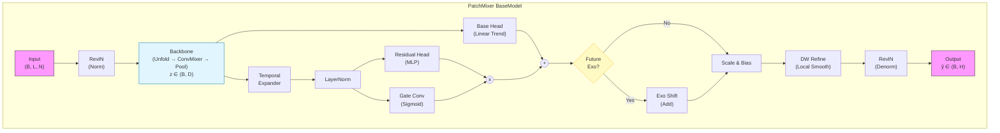
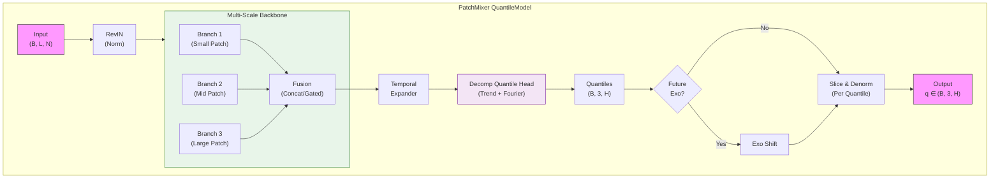
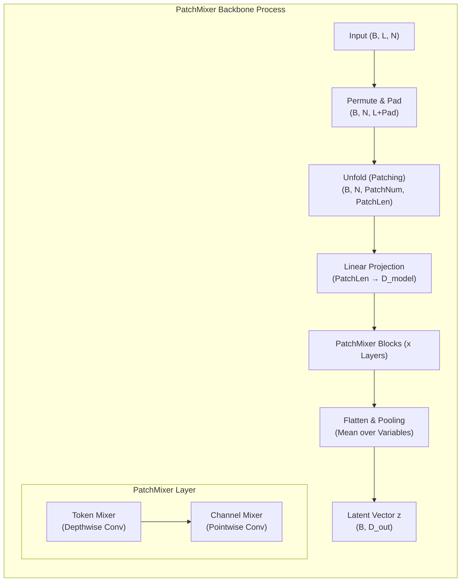
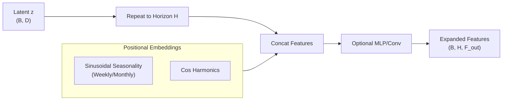

# PatchMixer: A Patch-Mixing Architecture for Long-Term Time Series Forecasting

> **기반 논문:** *PatchMixer: A Patch-Mixing Architecture for Long-Term Time Series Forecasting* (Gong et al., HKUST, 2024)  
> **문서 개요:** PatchMixer의 핵심 이론을 요약하고, 현재 구축된 **수요예측 모델(BaseModel / QuantileModel)** 구현체와의 구조적 연계를 설명합니다.

---

## 1. 연구 배경 및 문제의식

**Long-Term Time Series Forecasting (LTSF)** 분야에서 최근 Transformer 기반 모델(PatchTST 등)이 높은 성능을 보였습니다. 그러나 학계에서는 그 성능의 원천에 대해 근본적인 질문을 던졌습니다.

> **Research Question:** > "Patch-based Transformer의 성능은 복잡한 **Attention** 구조 때문인가, 아니면 **Patch 단위의 데이터 처리** 방식 때문인가?"

**PatchMixer**는 이 질문에 대해 **"핵심은 패치(Patching)에 있다"**고 답하며, Attention 없이 **CNN(Convolution)** 기반 구조만으로 SOTA 성능을 달성하여 이를 증명했습니다.

---

## 2. 핵심 아이디어: Patch-Mixing Design

PatchMixer는 시간축을 **패치(Patch)** 단위로 분할하여 로컬 정보를 보존하고, **Depthwise Separable Convolution**을 통해 패치 간의 관계를 효율적으로 학습합니다.

### 2.1 Channel vs. Patch Dependency
* **Channel Mixing (변수 간 혼합):** 다변량 변수 간의 상관관계 학습.
* **Patch Mixing (시간 패치 간 혼합):** 단일 변수 내의 시간적 패턴 학습.
    * *연구 결과:* LTSF에서는 **패치 간(Intra-variable)** 의존성이 더 중요함이 밝혀짐.

### 2.2 Patch Embedding
입력 시계열 $x^{(i)} \in \mathbb{R}^{L}$을 다음과 같이 패치 단위로 분할합니다.

$$
x^{(i)}_p = [x^{(i)}_{1:P}, x^{(i)}_{1+S:P+S}, \dots, x^{(i)}_{L-P+1:L}]
$$

* **P:** Patch Length (패치 길이)
* **S:** Stride (이동 간격)
* **Replicate Padding:** 마지막 구간의 정보 손실을 방지하기 위해 복제 패딩 적용.

---

## 3. PatchMixer 아키텍처 개요

### (1) 입력 구조 및 처리 과정
| 단계 | 텐서 형상 (Shape) | 설명 |
| :--- | :--- | :--- |
| **Input** | `(B, L, N)` | Batch, Lookback, Variables |
| **Norm** | `(B, L, N)` | **RevIN**: 분포 이동(Distribution Shift) 완화 |
| **Patching** | `(B, N, PatchNum, PatchSize)` | Unfold 연산 (Sliding Window) |
| **Projection** | `(B, N, PatchNum, D_model)` | Linear Layer를 통해 임베딩 차원으로 투영 |
| **Flatten** | `(B * N, PatchNum, D_model)` | 변수(N)와 배치(B)를 병합하여 독립적으로 처리 |

### (2) PatchMixer Block (CNN 기반)
Attention 대신 **Depthwise + Pointwise Conv** 구조를 사용하여 연산 효율성을 극대화합니다.

```python
# Residual Connection 구조
x = x + DepthwiseConv1d(x)     # Token Mixer: 패치 간 시간적 순서/관계 학습
x = PointwiseConv1d(x)         # Channel Mixer: 패치 내부 특징 결합
x = GELU + BatchNorm + Dropout
```

### (3) Instance Normalization (RevIN)
모델의 입력단에서 정규화(Normalize)하고, 출력단에서 역정규화(Denormalize)하는 구조를 통해 **비정상성(Non-stationary) 데이터**에 강건하게 대응합니다.

---

## 4. 현재 구현: 모델 구조 상세

구축된 라이브러리는 **BaseModel(점 예측)**과 **QuantileModel(구간 예측)**로 이원화되어 있습니다.

### 4.1 공통 사용자 정의 요소
* **Backbone:** `PatchMixerBackbone` (패치 기반 특징 추출)
* **Feature Injection:** 과거 외생 변수(Past Exo) 및 ID 임베딩 주입 (`z_gate`)
* **Future Exo:** 미래 외생 변수를 통한 선형 보정 (`Shift`)

---

### 4.2 PatchMixer BaseModel (Point Forecast)

단일 값(평균/기대값)을 예측하며, **Dual Head(Linear + Residual)** 구조와 **Gating**을 통해 안정성을 확보했습니다.

* **Output:** `(Batch, Horizon)`
* **Loss:** MSE / MAE
* **특징:**
    * **Trend:** Linear Head가 전체적인 추세를 담당.
    * **Residual:** MLP Head가 비선형적인 변동을 담당.
    * **Refinement:** Depthwise Conv가 지역적 곡률(Curvature)을 보정.



---

### 4.3 PatchMixer QuantileModel (Probabilistic Forecast)

불확실성 관리를 위해 **분위수(10%, 50%, 90%)**를 예측하며, 다양한 패턴 포착을 위해 **Multi-Scale Backbone**을 사용합니다.

* **Output:** `(Batch, 3, Horizon)`
* **Loss:** Pinball Loss (Quantile Loss)
* **특징:**
    * **Multi-Scale:** 작은 패치(급격한 변화)와 큰 패치(장기 추세)를 동시에 학습.
    * **Decomposition Head:** Trend와 Seasonality(Fourier)를 분해하여 예측.



---

### 4.4 주요 서브 모듈 구조

#### **(1) PatchMixer Backbone (Single Scale)**
패치를 생성하고 믹서 블록을 통과시켜 잠재 벡터 $z$를 생성하는 과정입니다.



#### **(2) Temporal Expander**
백본에서 압축된 정적 벡터를 미래 시점(Horizon)으로 확장하는 모듈입니다.



---

## 5. 결론 및 기대 효과

이 아키텍처는 **Transformer의 무거운 연산 비용을 제거**하면서도, 긴 시계열의 패턴을 효과적으로 포착합니다.

1.  **속도:** CNN 기반이므로 Transformer 대비 학습 및 추론 속도가 매우 빠릅니다.
2.  **성능:** 패치 단위의 의미론적 정보를 잘 보존하여 장기 예측(LTSF)에서 우수한 성능을 보입니다.
3.  **유연성:** BaseModel(정확도 중심)과 QuantileModel(불확실성 관리 중심)로 분리하여 비즈니스 목적에 맞는 모델 운용이 가능합니다.