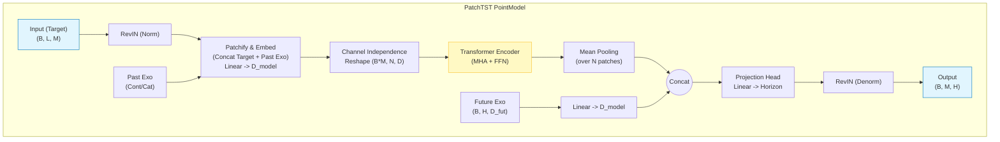
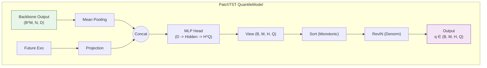

# PatchTST: A Time Series is Worth 64 Words

> **기반 논문:** *A Time Series is Worth 64 Words: Long-term Forecasting with Transformers* (Nie et al., ICLR 2023)  
> **문서 개요:** PatchTST의 핵심 이론을 요약하고, **과거/미래 외생변수(Exogenous Variables)** 처리가 포함된 현재 라이브러리의 구현체 구조를 설명합니다.

---

## 1. 연구 배경 및 핵심 아이디어

기존 Transformer 기반 시계열 모델들은 긴 시퀀스 예측(LTSF)에서 단순한 선형 모델(DLinear)보다 성능이 떨어지는 현상이 발생했습니다. PatchTST는 이를 해결하기 위해 두 가지 핵심 아이디어를 도입했습니다.

### 1.1 Patching (패치화)
시점(Time-step) 단위로 Attention을 수행하는 대신, **짧은 구간(Patch)**으로 데이터를 묶어 하나의 토큰으로 처리합니다.
- **장점 1:** 입력 시퀀스 길이($L$)가 패치 개수($N \approx L/P$)로 대폭 감소하여 연산량이 $O(L^2) \to O((L/P)^2)$로 줄어듭니다.
- **장점 2:** 국소적인 의미 정보(Local Semantic Information)를 보존하여 모델이 더 풍부한 패턴을 학습합니다.

### 1.2 Channel Independence (채널 독립성)
다변량 시계열의 각 변수(Channel)를 **독립적인 단변량 시계열**로 취급하여, 하나의 공유된 Transformer Backbone에 태웁니다.
- **장점:** 변수 간의 노이즈 섞임을 방지하고, 데이터 부족 문제를 완화하며 일반화 성능을 높입니다.

---

## 2. 모델 아키텍처 개요

현재 구현체는 원본 PatchTST를 확장하여 **과거(Past) 및 미래(Future) 외생변수**를 통합적으로 처리할 수 있도록 리팩토링되었습니다.

### (1) 전체 데이터 흐름
| 단계 | 설명 | 텐서 형상 (Shape) |
| :--- | :--- | :--- |
| **Input** | Target 변수 및 외생변수 입력 | Target: `(B, L, M)` <br> Exo: `(B, L, D_exo)` |
| **RevIN** | Target 변수 정규화 (분포 이동 완화) | `(B, L, M)` |
| **Unfold & Embed** | 패치 분할 후 투영 (Target + Past Exo) | `(B * M, Num_Patches, D_model)` |
| **Backbone** | Transformer Encoder (Self-Attention) | `(B * M, Num_Patches, D_model)` |
| **Aggregation** | 패치 차원 집약 (Mean Pooling) | `(B * M, D_model)` |
| **Exo Fusion** | 미래 외생변수(Future Exo) 결합 | `(B * M, D_model + D_future_proj)` |
| **Head** | 최종 예측 (Linear Projection) | `(B, M, Horizon)` |

---

## 3. 구현 모델 상세: BaseModel vs QuantileModel

### 3.1 공통 모듈: `PatchBackboneBase` & `SupervisedBackbone`
이 구현체의 가장 큰 특징은 **패치 임베딩 단계에서 외생 변수를 결합**한다는 점입니다.

1.  **입력 패치화:** Target 변수뿐만 아니라, Past Continuous/Categorical 변수도 동일하게 패치화(Unfold)합니다.
2.  **특징 결합 (Concatenation):**
    $$\text{Input}_{\text{patch}} = [\text{Target}_{\text{patch}} \parallel \text{Exo}_{\text{cont}} \parallel \text{Emb}(\text{Exo}_{\text{cat}})]$$
3.  **투영 (Projection):** 결합된 벡터를 `Linear` 레이어를 통해 `d_model` 차원으로 압축합니다.

---

### 3.2 PatchTST PointModel (BaseModel)
단일 값(평균)을 예측하는 모델입니다.

* **Head 구조:** `PointHeadWithExo`
* **Aggregation:** 백본에서 나온 $N$개의 패치 출력을 평균(Mean)내어 시계열 문맥 벡터를 생성합니다.
* **Future Exo:** 미래 외생변수를 투영하여 문맥 벡터와 결합(Concat) 후, 최종 Horizon 길이로 변환합니다.


### 3.3 PatchTST QuantileModel
불확실성 추정을 위해 분위수(Quantiles)를 예측합니다.

* **Head 구조:** `QuantileHeadWithExo`
* **출력:** `(Batch, Horizon, Quantiles)`
* **특징:** PointModel과 유사한 흐름을 가지지만, 마지막 Head가 분위수 개수($Q$)만큼 출력을 생성하며, `monotonic_quantiles` 옵션으로 분위수 교차를 방지합니다.



## 4. 주요 서브 모듈 상세

### 4.1 TSTEncoder (Transformer Backbone)
표준 Transformer Encoder를 사용하되, **Channel Independence**를 위해 배치 차원을 조작합니다.

* **입력:** `(B, M, N, D)` $\rightarrow$ `(B * M, N, D)`
* **구조:** `Norm` $\rightarrow$ `MHA` $\rightarrow$ `Add` $\rightarrow$ `Norm` $\rightarrow$ `FFN` $\rightarrow$ `Add`
* **특징:**
    * `batch_first=True` 기준 구현.
    * `Pre-Norm` / `Post-Norm` 선택 가능.
    * `GELU` 활성화 함수 사용.

### 4.2 Patching & Embedding 유틸리티
`modeling_module/models/PatchTST/common/backbone_base.py`에 정의된 로직입니다.

```python
# 의사 코드 (Pseudo-code)
def forward(x, p_cont, p_cat):
    # 1. 모든 입력을 [B, L+Pad, C] 형태로 패딩
    # 2. Unfold로 패치 생성 -> [B, N, C, P]
    patches_x = unfold(x)
    patches_c = unfold(p_cont)
    patches_cat = unfold(embedding(p_cat))
    
    # 3. 특징 차원(C) 기준으로 결합
    concat_vector = cat([patches_x, patches_c, patches_cat], dim=-1)
    
    # 4. d_model로 투영
    z = Linear(concat_vector) + PositionalEncoding
    return z
```

### 5. 결론
이 PatchTST 구현체는 원본 논문의 장기 예측 성능과 효율성을 유지하면서, 실제 비즈니스 데이터에서 필수적인 다양한 외생변수(가격, 날씨, 휴일 등)를 효과적으로 반영할 수 있도록 설계되었습니다.

확장성: 과거/미래 외생변수를 각각 인코더와 헤드 단계에 주입하여 정보 손실을 최소화.

유연성: Point 예측과 Quantile 예측을 모두 지원하여 결정적/확률적 수요예측에 모두 대응.

안정성: RevIN과 Channel Independence를 통해 데이터 분포 변화(Distribution Shift)에 강건함.